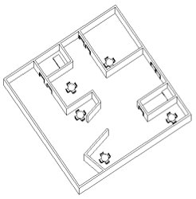
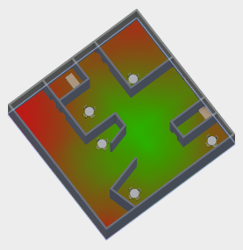
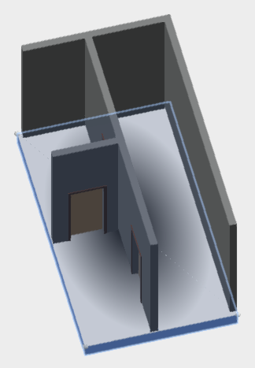
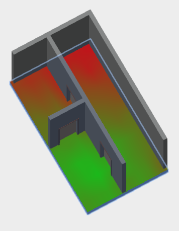

# ForgeFader

ForgeFader is a Forge viewer extension app that calculates and displays signal attenuation caused by distance and obstacles in a building model with a floor plan containing walls.

It makes use of JavaScript and [three.js](https://threejs.org) to 
implement a functionality similar to the Revit C# .NET 
add-in [RvtFader](https://github.com/jeremytammik/RvtFader):

Given a source point, calculate the attenuation in a widening circle around it and display that as a heat map.

Two signal attenuation values in decibels are defined in the application settings:

- Attenuation per metre in air
- Attenuation by a wall

The extension expects an RVT model with a floor element.
Two sample models are provided in the [test](test) subdirectory. 
You can translate them for Forge using your credentials and pass in the resulting `URN` to the viewer as described [below](#loading-custom-models-in-the-forge-viewer).

Here is one of the models in Revit and the result of processing it using Forgefader:

The four-minute [forgefader Autodesk Forge sample app](https://youtu.be/78JlGnf49mc) YouTube video explains some of the background and shows this sample app live in action.

ForgeFader is based 
on [Philippe Leefsma](https://github.com/leefsmp)'s 
[Forge React boilerplate sample](https://github.com/Autodesk-Forge/forge-react-boiler.nodejs).
Please refer to that for more details on the underlying architecture and components used.

## Implementation

The ForgeFader implementation lives
in [Viewing.Extension.Fader.Core.js](https://github.com/jeremytammik/forgefader/blob/master/src/client/viewer.components/Viewing.Extension.Fader/Viewing.Extension.Fader.Core.js).

On loading, in `onGeometryLoaded`, it determines the Revit BIM wall fragments for subsequent ray tracing.

On picking a point on a floor in the model, in `onSelection`, it launches the `attenuationCalculator` function to do the work.

That determines the picked floor top face and adds a new mesh to the model on which to draw the attenuation map.

Once the mesh has been added, it in turn calls `rayTraceToFindWalls` to create a bitmap representing the signal attenuation to be displayed by a custom shader.

The following sections describing details of the implementation process have also been published 
by [The Building Coder](http://thebuildingcoder.typepad.com):

- [Adding custom geometry to the Forge viewer](http://thebuildingcoder.typepad.com/blog/2017/03/adding-custom-geometry-to-the-forge-viewer.html)
- [Three.js raytracing in the Forge Viewer](http://thebuildingcoder.typepad.com/blog/2017/03/threejs-raytracing-in-the-forge-viewer.html)
- [Implementing a custom shader in the Forge Viewer](#shader) (blog post pending)

## Adding Custom Geometry to the Forge Viewer

When debugging any kind of geometrical programming task, it is of utmost importance to be able to comfortably visualise the situation.

In this app, I add three different kinds of geometry dynamically to the model displayed by the Forge viewer:

- Points and lines representing the top face of the floor and the picked source point.
- A mesh representing the top face of the floor to be equipped with a custom shader and offset slightly above and away from the floor element surface.
- Points and lines representing the raytracing rays.

Three example screen snapshots illustrate what I mean.

Display points and lines for debugging using `drawVertex` and `drawLine`:

Create a mesh to represent the floor top face and offset it up slightly above the floor surface:

A debug helper displaying lines in the model representing the ray tracing rays:

## Three.js Raytracing in the Forge Viewer

You cannot call the three.js `Raycaster.intersectObjects` directly on the Forge viewer fragments representing the Revit BIM walls.

One alternative approach is to analyse the Forge viewer fragments and generate new three.js mesh objects from them.

That is achieved by the `getMeshFromRenderProxy` function that successfully processes Revit BIM floors and walls.

It is called in `onGeometryLoaded` to generate meshes representing all walls in the model:

<pre class="prettyprint">
  this.wallMeshes = fragIds.map((fragId) => {
    return this.getMeshFromRenderProxy( 
      this.viewer.impl.getRenderProxy( 
        this.viewer.model, fragId ), null, null, null );
  })
</pre>

These meshes are used to determine the number of walls between a given pair of source and target points by `getWallCountBetween`.

I raised a question with the Forge viewer development team before embarking on the research to implement the above.
Unfortunately, due to time differences, they replied only after I had completed it:

[Q@14:19] How can I invoke `Raycaster.intersectObjects` with viewer fragments?

[Q@21:35] I solved my `Raycaster.intersectObjects` challenge by [generating my own threejs mesh from the lmv original](https://github.com/jeremytammik/forgefader/compare/0.0.13...0.0.15).

[A@21:39] Ok well, for the record, you can intersect the whole scene using `viewer.impl.rayIntersect`, or you can do it per model via `model.rayIntersect`, or per mesh via `VBIntersector.rayCast`. The first two approaches take advantage of the spatial index acceleration structure.

[Q@21:42] Thank you for the info! I assume these approaches would offer multiple advantages: (i) more efficient (ii) easier to set up and use (iii) more fool- and future-proof. Do you agree?

[A@21:43] Probably better to use the high level hit testing APIs instead of messing with internal mesh representation directly... i.e. avoid doing fragile stuff like `this.viewer.impl.getRenderProxy(this.viewer.model, fragId)`.

In summary, you might be better off ignoring the interesting solution I present above and using the built-in viewer functionality instead.

## Implementing a Custom Shader in the Forge Viewer

In the main [commit](https://github.com/jeremytammik/forgefader/commit/58dbdeb412b42eaf9a82d5109cfe352b6b3b02bb) 
of [release 0.0.30](https://github.com/jeremytammik/forgefader/releases/tag/0.0.30), 
Cyrille Fauvel shows how a custom shader can be applied to a Forge viewer element, initially, for testing puurposes, as a radial gradient:

In [release 0.0.32](https://github.com/jeremytammik/forgefader/releases/tag/0.0.32)
(cf. the [diff](https://github.com/jeremytammik/forgefader/compare/0.0.31...0.0.32)) Cyrille replaces the hard-wired radial gradiant by the real thing, a testure map displaying the signal attenuation:

## Running the Sample

Configuration is controlled by **NODE_ENV**
[environment variable](https://www.google.com/webhp?q=set+environment+variable&gws_rd=cr&ei=tum2WMaSF4SdsgHruLrIDg),
make sure to set it properly to **development** or **production**,
based on the configuration type you want to run.

In **development**, the client is dynamically built by the
[webpack-dev-middleware](https://github.com/webpack/webpack-dev-middleware), so just run:

 - `npm install`    *(downloads project dependencies locally)*

 - `npm start`      *(builds client on the fly and run server)*

 - open [http://localhost:3000](http://localhost:3000) in your favourite browser

In **production**, the client requires a build step, so run:

 - `npm install` *(not required if you already run at previous step)*

 - `npm run build-prod && npm start` *(builds client and run server)*

 - open [http://localhost:3000](http://localhost:3000) in your favourite browser

## Loading Custom Models in the Forge Viewer

To load a model into the Forge viewer for this extension to process, you first need to generate a viewable **URN** as documented in the
[Prepare a File for the Viewer](https://developer.autodesk.com/en/docs/model-derivative/v2/tutorials/prepare-file-for-viewer/) tutorial.

One easy way to achieve this manually is to upload it 
to [models.autodesk.io](https://models.autodesk.io).

Using the same Forge ClientId & ClientSecret used to upload the model,
populate environment variables used by the config files (in **/config**):

  - development:

    `FORGE_DEV_CLIENT_ID`

    `FORGE_DEV_CLIENT_SECRET`

  - production:

    `FORGE_CLIENT_ID`

    `FORGE_CLIENT_SECRET`

Restart the server; you can then directly load your model by specifying the resulting design **URN** as query parameter in the url of the viewer page, e.g.:

- [http://localhost:3000/viewer?urn=YOUR_URN_HERE](http://localhost:3000/viewer?urn=YOUR_DESIGN_URN_HERE)

## Deploy to Heroku

Using your **Forge ClientId and ClientSecret** obtained while
[Creating a new Forge App](https://developer.autodesk.com/myapps/create),
press this button:

## More about the Autodesk Forge Platform and Web Applications of the Future

Check it out at [developer.autodesk.com](https://developer.autodesk.com).

Look at our [Quickstarts guide](https://developer.autodesk.com/en/docs/quickstarts/v1/overview/)
to find the Forge SDK's for the programming language of your choice.

## Author

Jeremy Tammik,
[The Building Coder](http://thebuildingcoder.typepad.com),
[ADN](http://www.autodesk.com/adn)
[Open](http://www.autodesk.com/adnopen),
[Autodesk Inc.](http://www.autodesk.com)

## License

This sample is licensed under the terms of the [MIT License](http://opensource.org/licenses/MIT).
Please see the [LICENSE](LICENSE) file for full details.
